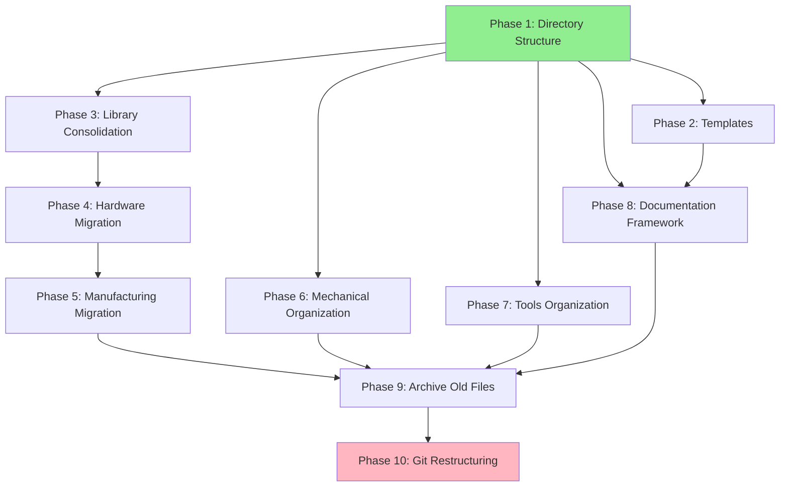
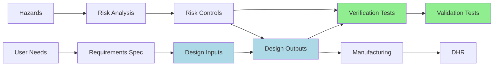

# MobMon12 Medical Device Repository Restructuring Plan

## Overview
This document outlines the plan to restructure the MobMon12 hardware repository to meet medical device regulatory requirements (ISO 13485, ISO 14971, IEC 60601, FDA 21 CFR Part 820).

**Project:** MobMon12 Medical Monitoring Device
**Organization:** Kallows Engineering India Pvt Ltd
**Date:** 2025-10-20
**Status:** Planning Phase

---

## Objectives

### Primary Goals
1. **Regulatory Compliance**: Structure supports ISO 13485, ISO 14971, IEC 60601, FDA QSR
2. **Complete Traceability**: Requirements → Design → Verification → Validation
3. **Change Control**: Formal ECO process with impact analysis
4. **Design History File**: Complete DHF per 21 CFR 820.30
5. **Risk Management**: Complete RMF per ISO 14971
6. **Manufacturing Control**: Clear DMR and DHR structure

### Secondary Goals
1. Improve organization and findability
2. Separate source files from generated outputs
3. Centralize libraries for consistency
4. Enable automation (BOM validation, output generation, traceability)
5. Support concurrent development of multiple board variants

---

## Implementation Flow



## Traceability Flow



## Implementation Phases

### Phase 1: Directory Structure Creation ✓ (Current)
**Objective:** Create empty directory structure with documentation

**Tasks:**
- [ ] Create all directories per new structure
- [ ] Create README.md in each major section explaining purpose
- [ ] Create placeholder files where needed
- [ ] Create root-level documentation (README, CHANGELOG)
- [ ] Set up Git configuration (.gitignore, .gitattributes)

**Deliverables:**
- Complete directory tree
- README files in all major directories
- Git configuration files
- Root documentation files

**Duration:** 1 day

---

### Phase 2: Template Creation
**Objective:** Create document templates for compliance

**Tasks:**
- [ ] DHF document templates
  - [ ] Design plan template
  - [ ] Design review template
  - [ ] Test protocol template
  - [ ] Test report template
  - [ ] Verification/validation templates
- [ ] RMF templates
  - [ ] Hazard analysis template
  - [ ] FMEA template
  - [ ] Risk assessment matrix template
- [ ] DMR templates
  - [ ] Work instruction template
  - [ ] Inspection procedure template
- [ ] Quality system templates
  - [ ] ECO template
  - [ ] Nonconformance report template
  - [ ] CAPA template
- [ ] Hardware revision templates
  - [ ] RELEASE_NOTES.md template
  - [ ] metadata.json schema

**Deliverables:**
- Complete set of document templates
- Templates follow 21 CFR 820 requirements
- Templates include version control fields

**Duration:** 2-3 days

---

### Phase 3: Library Consolidation
**Objective:** Consolidate scattered libraries into central location

**Tasks:**
- [ ] Audit all existing footprint libraries
  - [ ] Kallows.pretty across all revisions
  - [ ] KallowsYoke.pretty
  - [ ] SamacSys_Parts.pretty
  - [ ] Identify duplicates and conflicts
- [ ] Consolidate to libraries/ directory
  - [ ] Merge duplicate footprints (keep latest version)
  - [ ] Resolve naming conflicts
  - [ ] Document any breaking changes
- [ ] Extract symbols to central library
  - [ ] Currently embedded in schematics
  - [ ] Create Kallows_Symbols.kicad_sym
- [ ] Consolidate 3D models
  - [ ] Move to libraries/3dmodels/
- [ ] Create library changelogs
  - [ ] Track what changed during consolidation
- [ ] Create sym-lib-table and fp-lib-table
  - [ ] Use relative paths
  - [ ] Point to centralized libraries

**Deliverables:**
- Single source of truth for all libraries
- Library changelogs
- KiCAD library configuration files

**Duration:** 3-4 days

**Risk:** May break existing projects temporarily until Phase 4 migration

---

### Phase 4: Hardware File Migration
**Objective:** Migrate existing hardware designs to new structure

**Tasks:**
- [ ] Create migration script
  - [ ] Copies files to new locations
  - [ ] Preserves Git history where possible
  - [ ] Updates library paths in .kicad_pro files
- [ ] Migrate mainboard revisions
  - [ ] rev04 → hardware/mainboard/rev04/
  - [ ] rev05a → hardware/mainboard/rev05a/
  - [ ] rev05b → hardware/mainboard/rev05b/
  - [ ] rev06a → hardware/mainboard/rev06a/
  - [ ] rev06b → hardware/mainboard/rev06b/
  - [ ] Rename files to consistent naming (mobmon12_mainboard.*)
- [ ] Migrate yoke revisions
  - [ ] rev01a, rev01b, rev02c
- [ ] Migrate defib designs
- [ ] Update library references
  - [ ] Point to libraries/ directory
  - [ ] Update sym-lib-table and fp-lib-table in each project
- [ ] Create symlinks for 'latest'
  - [ ] hardware/mainboard/latest → rev06a
  - [ ] hardware/yoke/latest → rev02c
- [ ] Create RELEASE_NOTES.md for each revision
  - [ ] Document what changed in that revision
  - [ ] Extract from existing commit messages if available

**Deliverables:**
- All hardware files in new structure
- Working projects with updated library paths
- Revision documentation

**Duration:** 2-3 days

**Validation:**
- Open each project in KiCAD and verify:
  - All symbols load correctly
  - All footprints load correctly
  - No missing references
  - DRC passes (if it passed before)

---

### Phase 5: Manufacturing Output Migration
**Objective:** Move manufacturing outputs to new structure

**Tasks:**
- [ ] Audit existing manufacturing outputs
  - [ ] Gerber files in gerbers_* directories
  - [ ] BOM files
  - [ ] Assembly files (ibom.html, etc.)
  - [ ] Panelization projects
- [ ] Migrate to manufacturing/ structure
  - [ ] Organize by board type and revision
  - [ ] Separate gerbers, assembly, docs, panels
- [ ] Create MANIFEST.md for each manufactured revision
  - [ ] Document what was manufactured
  - [ ] When (date)
  - [ ] Where (manufacturer)
  - [ ] Quantity
  - [ ] Known issues
- [ ] Update .gitignore
  - [ ] Ignore generated files
  - [ ] Keep MANIFEST.md and metadata

**Deliverables:**
- Manufacturing outputs organized by revision
- MANIFEST files documenting production history
- Updated .gitignore

**Duration:** 1-2 days

---

### Phase 6: Mechanical File Organization
**Objective:** Organize mechanical CAD files

**Tasks:**
- [ ] Move FreeCAD files to mechanical/ directory
  - [ ] USB Cover → mechanical/connectors/freecad/
  - [ ] DSUB Cover → mechanical/connectors/freecad/
- [ ] Organize STL files
  - [ ] Move to mechanical/connectors/stl/
  - [ ] Remove duplicates
- [ ] Move STEP files
  - [ ] mechanical/connectors/step/
- [ ] Create revision log for mechanical files
- [ ] Create README explaining each design

**Deliverables:**
- Organized mechanical directory
- Documentation for each mechanical component

**Duration:** 1 day

---

### Phase 7: Tools Organization
**Objective:** Organize scripts and tools

**Tasks:**
- [ ] Move and organize Python scripts
  - [ ] kallows_bom_search.py → tools/bom/
  - [ ] Panelization scripts → tools/panelization/
- [ ] Create requirements.txt for each tool directory
  - [ ] Document Python dependencies
- [ ] Create config files
  - [ ] Move API keys to config files (not in code)
  - [ ] Add config files to .gitignore
  - [ ] Create config.example files for reference
- [ ] Create README for each tool
  - [ ] Installation instructions
  - [ ] Usage instructions
  - [ ] Configuration options
- [ ] Create new automation tools
  - [ ] generate_outputs.py - Generate all manufacturing outputs
  - [ ] validate_design.py - Run DRC/ERC checks
  - [ ] bom_validator.py - Validate BOM against approved parts list

**Deliverables:**
- Organized tools directory
- Documentation for each tool
- New automation scripts
- Secure configuration management

**Duration:** 2-3 days

---

### Phase 8: Documentation Framework
**Objective:** Set up documentation structure (not content yet)

**Tasks:**
- [ ] Create DHF directory structure
  - [ ] All subdirectories per plan
  - [ ] README in each explaining what goes there
- [ ] Create RMF directory structure
- [ ] Create DMR directory structure
- [ ] Create regulatory directory structure
  - [ ] Subdirectories for FDA, EU MDR, standards
- [ ] Create quality directory structure
  - [ ] SOPs, forms, procedures
- [ ] Create technical directory structure
- [ ] Create index documents
  - [ ] docs/README.md - Navigation guide
  - [ ] docs/DHF/README.md - DHF overview
  - [ ] docs/RMF/README.md - RMF overview

**Deliverables:**
- Complete documentation directory structure
- Navigation aids
- README files explaining each section

**Duration:** 1-2 days

---

### Phase 9: Archive Old Files
**Objective:** Move obsolete files to archive

**Tasks:**
- [ ] Identify files not migrated
  - [ ] -backups directories
  - [ ] _old directories
  - [ ] Obsolete revisions (rev01, rev02, rev03 if they exist)
- [ ] Move to archive/ directory
  - [ ] Preserve directory structure for reference
  - [ ] Document what was archived and why
- [ ] Create archive index
  - [ ] List what's in archive
  - [ ] Why it was archived
  - [ ] When it was archived

**Deliverables:**
- Clean working directory
- Archived files preserved for reference
- Archive documentation

**Duration:** 1 day

---

### Phase 10: Git Repository Restructuring
**Objective:** Commit new structure to Git

**Tasks:**
- [ ] Review Git history preservation strategy
  - [ ] Decide: new structure in same repo vs. new repo
  - [ ] If same repo: use git mv to preserve history
- [ ] Create feature branch for restructuring
  - [ ] Branch: feature/medical-device-structure
- [ ] Commit changes in logical groups
  - [ ] Directory structure creation
  - [ ] Library consolidation
  - [ ] File migrations
  - [ ] Documentation
- [ ] Create detailed commit messages
  - [ ] Explain what changed and why
  - [ ] Reference this implementation plan
- [ ] Tag the transition point
  - [ ] Tag: v1.0.0-restructured
- [ ] Update .gitignore and .gitattributes
  - [ ] Ignore generated files
  - [ ] Configure LFS for large binaries if needed

**Deliverables:**
- Restructured repository in Git
- Preserved history where possible
- Clear tag marking transition

**Duration:** 1 day

**Note:** Consider creating a backup of entire repository before this phase

---

## Migration Strategy

### Approach: Parallel Structure
To minimize disruption, we'll create the new structure alongside the old:

1. **Phase 1-2**: Create new directories and templates (doesn't affect existing work)
2. **Phase 3-5**: Copy (not move) files to new locations
3. **Validation**: Verify new structure works completely
4. **Phase 9**: Archive old structure
5. **Cutover**: Switch to working exclusively in new structure

### Git Strategy
- Use `git mv` where possible to preserve history
- For consolidated libraries, document provenance in changelog
- Tag the cutover point clearly
- Consider squashing intermediate commits for cleaner history

### Rollback Plan
If issues are discovered:
1. Old structure remains in archive/ for reference
2. Git tag allows reverting to pre-restructure state
3. Document any issues encountered and solutions

---

## Directory Structure Summary

```
mobmon12/
├── docs/                      # All compliance documentation
│   ├── DHF/                   # Design History File
│   ├── RMF/                   # Risk Management File
│   ├── DMR/                   # Device Master Record
│   ├── regulatory/            # Regulatory submissions
│   ├── quality/               # QMS documents
│   ├── technical/             # Technical docs
│   └── templates/             # Document templates
├── hardware/                  # KiCAD design files
│   ├── mainboard/
│   ├── yoke/
│   └── defib/
├── libraries/                 # Shared libraries
│   ├── symbols/
│   ├── footprints/
│   └── 3dmodels/
├── mechanical/                # CAD files
├── manufacturing/             # Production outputs
├── tools/                     # Scripts and utilities
├── config/                    # Configuration files
└── archive/                   # Old/obsolete files
```

---

## Success Criteria

### Technical Validation
- [ ] All KiCAD projects open without errors
- [ ] All symbols and footprints load correctly
- [ ] All library references resolve
- [ ] No broken file paths
- [ ] Manufacturing outputs regenerate correctly

### Compliance Validation
- [ ] DHF structure matches 21 CFR 820.30 requirements
- [ ] RMF structure matches ISO 14971 requirements
- [ ] DMR structure matches 21 CFR 820.181 requirements
- [ ] Traceability can be established from requirements to validation
- [ ] Change control process is defined

### Usability Validation
- [ ] Team can find files easily
- [ ] Documentation explains structure clearly
- [ ] README files provide guidance
- [ ] New team members can onboard using documentation

---

## Risk Assessment

| Risk | Probability | Impact | Mitigation |
|------|------------|--------|------------|
| Broken library references | High | High | Thorough testing after migration; keep old structure until validated |
| Lost Git history | Medium | Medium | Use git mv; tag transition point; backup repository |
| Team disruption | Medium | Medium | Good documentation; training; parallel structure during transition |
| Missing files in migration | Low | High | Checklist; systematic migration; validation steps |
| Configuration errors | Medium | Medium | Test in isolated environment first; document all path changes |

---

## Timeline Estimate

| Phase | Duration | Dependencies |
|-------|----------|--------------|
| Phase 1: Directory Structure | 1 day | None |
| Phase 2: Templates | 2-3 days | Phase 1 |
| Phase 3: Library Consolidation | 3-4 days | Phase 1 |
| Phase 4: Hardware Migration | 2-3 days | Phase 3 |
| Phase 5: Manufacturing Migration | 1-2 days | Phase 4 |
| Phase 6: Mechanical Organization | 1 day | Phase 1 |
| Phase 7: Tools Organization | 2-3 days | Phase 1 |
| Phase 8: Documentation Framework | 1-2 days | Phase 1-2 |
| Phase 9: Archive | 1 day | Phase 4-7 |
| Phase 10: Git Restructuring | 1 day | All previous |
| **Total** | **15-22 days** | |

**Note:** Timeline assumes dedicated effort. Can be stretched over longer period if working part-time.

---

## Next Steps

### Immediate Actions (Today)
1. ✓ Document this plan
2. Create base directory structure (Phase 1)
3. Create README files for all major sections
4. Set up Git configuration

### This Week
1. Complete Phase 1 (Directory Structure)
2. Start Phase 2 (Template Creation)
3. Begin Phase 3 (Library Audit)

### Next Week
1. Complete library consolidation (Phase 3)
2. Begin hardware migration (Phase 4)
3. Validate migrated projects

---

## Approval and Sign-off

This plan should be reviewed and approved by:
- [ ] Engineering Lead
- [ ] Quality/Regulatory Manager
- [ ] Project Manager

**Approved by:** _________________
**Date:** _________________

---

## Document Control

| Version | Date | Author | Changes |
|---------|------|--------|---------|
| 1.0 | 2025-10-20 | Claude Code | Initial plan created |

**Document ID:** PLAN-001
**Next Review:** After Phase 5 completion
