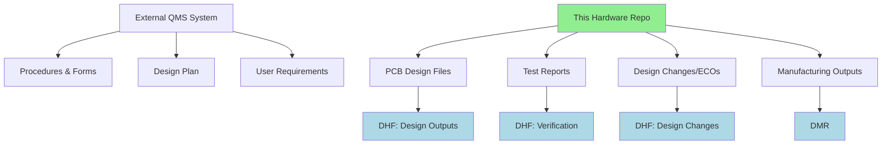
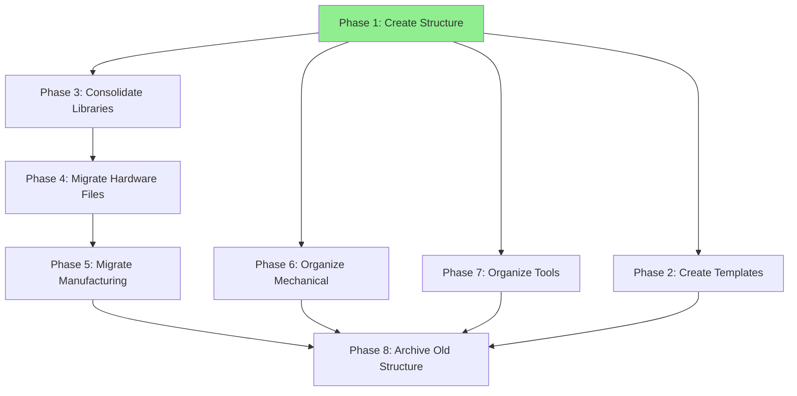

# MobMon12 Hardware Design Repository Restructuring Plan

## Overview
This document outlines the plan to restructure the MobMon12 **hardware design repository** (PCB designs only). This repository contains design outputs that feed into the larger Design History File (DHF) maintained separately.

**Project:** MobMon12 Medical Monitoring Device - Hardware Design
**Organization:** Kallows Engineering India Pvt Ltd
**Date:** 2025-10-20
**Scope:** PCB design files, libraries, manufacturing outputs, and hardware-specific documentation

---

## Repository Scope

### What This Repository Contains
- KiCAD PCB design files (schematics, layouts, libraries)
- Manufacturing outputs (gerbers, BOMs, assembly files)
- Hardware design documentation (design notes, test reports, calculations)
- Risk analysis specific to hardware design
- Design change records (ECOs) for hardware
- Tools and scripts for PCB development

### What This Repository Does NOT Contain
- Overall quality management procedures (maintained in QMS)
- Regulatory submissions (maintained separately)
- Clinical documentation
- Software design files
- General company procedures and forms

### Interface with DHF
This repository provides **Design Output** documentation that feeds into:
- DHF Section: Design Outputs → Electrical Design
- DHF Section: Verification → Hardware Verification Test Reports
- DHF Section: Design Changes → Hardware ECOs
- RMF: Hardware-specific hazard analysis and risk controls



---

## Revised Directory Structure

```
mobmon12-hardware/                          # Root directory
├── README.md                               # Repository overview and navigation
├── CHANGELOG.md                            # Hardware revision changelog
├── IMPLEMENTATION_PLAN.md                  # This document
│
├── hardware/                               # PCB DESIGN FILES
│   ├── mainboard/                          # Main monitoring board
│   │   ├── latest -> rev06a/              # Symlink to current development
│   │   ├── rev04/
│   │   │   ├── mobmon12_mainboard.kicad_pro
│   │   │   ├── mobmon12_mainboard.kicad_sch
│   │   │   ├── *.kicad_sch                # Hierarchical sheets
│   │   │   ├── mobmon12_mainboard.kicad_pcb
│   │   │   ├── DESIGN_NOTES.md            # Design decisions, calculations
│   │   │   ├── VERIFICATION_SUMMARY.md    # Test results summary
│   │   │   └── metadata.json              # Machine-readable metadata
│   │   ├── rev05a/
│   │   ├── rev05b/
│   │   ├── rev06a/
│   │   └── rev06b/
│   │
│   ├── yoke/                               # Yoke/connector board
│   │   ├── latest -> rev02c/
│   │   ├── rev01a/
│   │   ├── rev01b/
│   │   └── rev02c/
│   │
│   └── defib/                              # Defibrillator board
│       ├── latest -> rev01a/
│       └── rev01a/
│
├── libraries/                              # SHARED COMPONENT LIBRARIES
│   ├── symbols/
│   │   ├── Kallows_Symbols.kicad_sym
│   │   ├── CHANGELOG.md                   # Track library changes
│   │   └── README.md
│   │
│   ├── footprints/
│   │   ├── Kallows.pretty/
│   │   ├── KallowsYoke.pretty/
│   │   ├── SamacSys_Parts.pretty/
│   │   ├── CHANGELOG.md
│   │   └── README.md
│   │
│   └── 3dmodels/
│       ├── Kallows.3dshapes/
│       ├── SamacSys_Parts.3dshapes/
│       └── README.md
│
├── mechanical/                             # MECHANICAL CAD (enclosures, covers)
│   ├── enclosure/
│   │   ├── freecad/
│   │   │   └── *.FCStd
│   │   ├── step/
│   │   │   └── *.step
│   │   ├── stl/                           # For prototyping
│   │   │   └── *.stl
│   │   └── README.md
│   │
│   └── connectors/
│       ├── freecad/
│       │   ├── usb_cover.FCStd
│       │   └── dsub_cover.FCStd
│       ├── stl/
│       └── README.md
│
├── docs/                                   # HARDWARE-SPECIFIC DOCUMENTATION
│   ├── design/                             # Design documentation
│   │   ├── architecture/
│   │   │   ├── system_block_diagram.md
│   │   │   ├── power_architecture.md
│   │   │   └── signal_flow.md
│   │   │
│   │   ├── calculations/                   # Design calculations
│   │   │   ├── power_budget.xlsx
│   │   │   ├── thermal_analysis.xlsx
│   │   │   ├── impedance_calculations.md
│   │   │   └── signal_integrity/
│   │   │
│   │   ├── component_selection/
│   │   │   ├── critical_components_rationale.md
│   │   │   ├── obsolescence_plan.md
│   │   │   └── approved_parts_list.xlsx
│   │   │
│   │   └── standards_compliance/
│   │       ├── IEC_60601-1_design_checklist.md
│   │       ├── IEC_60601-1-2_emc_design.md
│   │       └── isolation_design.md
│   │
│   ├── verification/                       # Hardware verification
│   │   ├── test_plans/
│   │   │   ├── electrical_safety_test_plan.md
│   │   │   ├── emc_test_plan.md
│   │   │   └── functional_test_plan.md
│   │   │
│   │   ├── test_reports/                   # Results from verification
│   │   │   ├── mainboard_rev06a/
│   │   │   │   ├── electrical_safety_report.md
│   │   │   │   ├── functional_test_report.md
│   │   │   │   └── test_data/             # Raw data, screenshots
│   │   │   └── yoke_rev02c/
│   │   │
│   │   └── test_procedures/                # Detailed test procedures
│   │       ├── power_supply_test.md
│   │       ├── ecg_signal_path_test.md
│   │       └── isolation_test.md
│   │
│   ├── risk/                               # Hardware-specific risk analysis
│   │   ├── hardware_hazard_analysis.xlsx   # Hazards specific to HW
│   │   ├── hardware_fmea.xlsx              # FMEA for PCB
│   │   ├── risk_control_implementation.md  # How risks are controlled in HW
│   │   └── README.md                       # Links to main RMF
│   │
│   ├── changes/                            # Engineering Change Orders
│   │   ├── ECO_template.md
│   │   ├── ECO_001_capacitor_value_change.md
│   │   ├── ECO_002_connector_replacement.md
│   │   └── ECO_log.xlsx                    # Master ECO log
│   │
│   └── datasheets/                         # Component datasheets
│       ├── microcontroller/
│       ├── analog_frontend/
│       └── power_management/
│
├── manufacturing/                          # PRODUCTION OUTPUTS
│   ├── mainboard/
│   │   ├── rev06a/
│   │   │   ├── gerbers/
│   │   │   │   ├── mainboard_rev06a_gerbers.zip
│   │   │   │   └── checksum.md5
│   │   │   │
│   │   │   ├── assembly/
│   │   │   │   ├── bom_rev06a.xlsx        # Master BOM
│   │   │   │   ├── bom_jlcpcb.csv         # Manufacturer-specific
│   │   │   │   ├── cpl_rev06a.csv         # Component placement
│   │   │   │   ├── ibom.html              # Interactive BOM
│   │   │   │   └── assembly_drawings.pdf
│   │   │   │
│   │   │   ├── fabrication/
│   │   │   │   ├── stackup.pdf
│   │   │   │   ├── impedance_requirements.pdf
│   │   │   │   └── fab_notes.md
│   │   │   │
│   │   │   ├── panels/
│   │   │   │   └── panel_design.kicad_pcb
│   │   │   │
│   │   │   ├── documentation/
│   │   │   │   ├── schematic_rev06a.pdf
│   │   │   │   ├── layout_assembly_top.pdf
│   │   │   │   └── layout_assembly_bottom.pdf
│   │   │   │
│   │   │   └── RELEASE_MANIFEST.md        # Release package info
│   │   │
│   │   └── rev06b/
│   │
│   ├── yoke/
│   │   └── rev02c/
│   │
│   └── panels/                             # Multi-board panelization
│       └── mainboard_yoke_panel_v1/
│
├── tools/                                  # SCRIPTS AND UTILITIES
│   ├── bom/
│   │   ├── kallows_bom_search.py
│   │   ├── bom_validator.py               # Validate against approved parts
│   │   ├── requirements.txt
│   │   ├── config.example.yaml            # Example config (no secrets)
│   │   └── README.md
│   │
│   ├── panelization/
│   │   ├── panelize_multiple.py
│   │   ├── panelize_config.yaml
│   │   ├── requirements.txt
│   │   └── README.md
│   │
│   ├── fabrication/
│   │   ├── generate_manufacturing_outputs.py
│   │   ├── validate_design.py             # Run DRC, ERC
│   │   ├── generate_release_package.py
│   │   └── README.md
│   │
│   └── traceability/
│       ├── generate_bom_traceability.py
│       └── README.md
│
├── config/                                 # CONFIGURATION
│   ├── kicad/
│   │   ├── sym-lib-table                  # Symbol library table
│   │   ├── fp-lib-table                   # Footprint library table
│   │   └── README.md
│   │
│   ├── templates/
│   │   ├── revision_template/             # Template for new revision
│   │   │   ├── DESIGN_NOTES.md
│   │   │   ├── VERIFICATION_SUMMARY.md
│   │   │   └── metadata.json
│   │   └── document_templates/
│   │       ├── ECO_template.md
│   │       └── test_report_template.md
│   │
│   └── git/
│       └── .gitignore
│
└── archive/                                # OLD/OBSOLETE FILES
    └── pre_restructure/                   # Files before restructuring
```

---

## Simplified Implementation Phases



### Phase 1: Create Directory Structure (Today)
- [ ] Create all directories
- [ ] Create README.md files explaining each section
- [ ] Set up .gitignore

### Phase 2: Create Templates (1 day)
- [ ] Hardware revision templates (DESIGN_NOTES.md, metadata.json)
- [ ] ECO template
- [ ] Test report templates
- [ ] Release manifest template

### Phase 3: Consolidate Libraries (2-3 days)
- [ ] Audit existing libraries across all revisions
- [ ] Consolidate to libraries/ directory
- [ ] Create library changelogs
- [ ] Set up sym-lib-table and fp-lib-table

### Phase 4: Migrate Hardware Files (2 days)
- [ ] Move designs to hardware/ structure
- [ ] Rename files consistently
- [ ] Update library paths
- [ ] Create DESIGN_NOTES.md for each revision
- [ ] Create symlinks to 'latest'

### Phase 5: Migrate Manufacturing Outputs (1 day)
- [ ] Organize gerbers, BOMs, assembly files
- [ ] Create RELEASE_MANIFEST.md for each
- [ ] Document what was manufactured

### Phase 6: Organize Mechanical Files (0.5 day)
- [ ] Move FreeCAD, STL, STEP files
- [ ] Create mechanical README

### Phase 7: Organize Tools (1 day)
- [ ] Move Python scripts
- [ ] Create requirements.txt
- [ ] Externalize configurations
- [ ] Create tool documentation

### Phase 8: Archive Old Structure (0.5 day)
- [ ] Move old directories to archive/
- [ ] Create archive index

**Total Estimated Time: 8-10 days**

---

## Key File Descriptions

### Per-Revision Files

#### DESIGN_NOTES.md
Documents design decisions, calculations, and rationale for this specific revision.

```markdown
# Mainboard Rev06a Design Notes

## Design Changes from Rev05b
- Changed C15 from 10µF to 22µF to improve ripple rejection
- Added R23 pull-down on RESET line
- Moved U5 away from high-current trace

## Critical Design Decisions
### Power Supply
- Selected LDO over buck converter for lower noise
- Calculated: [link to calculation]

## Known Issues
- None at time of release

## Verification Status
- [x] Electrical safety tests passed
- [x] EMC pre-compliance passed
- [ ] Full EMC pending
```

#### VERIFICATION_SUMMARY.md
Summary of verification testing performed on this revision.

```markdown
# Mainboard Rev06a Verification Summary

## Tests Completed
| Test | Date | Result | Report Link |
|------|------|--------|-------------|
| Electrical Safety | 2024-01-15 | PASS | [link] |
| Functional Test | 2024-01-20 | PASS | [link] |
| EMC Pre-test | 2024-02-01 | PASS with notes | [link] |

## Outstanding Issues
- Minor EMC issue at 145MHz (below limit but needs attention)

## Approval for Production
Approved by: ____________
Date: ____________
```

#### metadata.json
Machine-readable metadata for automation.

```json
{
  "board_name": "mobmon12_mainboard",
  "revision": "rev06a",
  "date_created": "2024-01-10",
  "kicad_version": "9.0",
  "status": "released",
  "compliance": {
    "iec_60601_1": "designed_for",
    "iec_60601_1_2": "designed_for",
    "iec_60601_2_27": "designed_for"
  },
  "verification_status": "complete",
  "manufacturing_status": "in_production"
}
```

#### RELEASE_MANIFEST.md
Documents what was released for manufacturing.

```markdown
# Manufacturing Release: Mainboard Rev06a

## Release Information
- **Release Date:** 2024-03-01
- **Released By:** John Doe
- **Approved By:** Jane Smith
- **Release Package:** mainboard_rev06a_release_v1.0.zip
- **Package Checksum:** abc123def456

## Contents
- Gerbers: mainboard_rev06a_gerbers.zip
- BOM: bom_rev06a.xlsx
- Assembly: cpl_rev06a.csv, ibom.html
- Documentation: schematic_rev06a.pdf

## Manufacturer
- **Primary:** JLCPCB
- **Order Date:** 2024-03-05
- **Quantity:** 50 units
- **PO Number:** PO-2024-001

## Changes from Rev05b
- See ECO-015, ECO-016, ECO-017

## Known Issues
- None
```

---

## Success Criteria

- [ ] All KiCAD projects open without errors
- [ ] All library references resolve correctly
- [ ] Manufacturing outputs can be regenerated
- [ ] Clear documentation in each section
- [ ] Easy to find any file
- [ ] Ready to integrate with external DHF

---

## Next Actions

1. Create directory structure
2. Create README files for navigation
3. Create templates
4. Begin library consolidation

