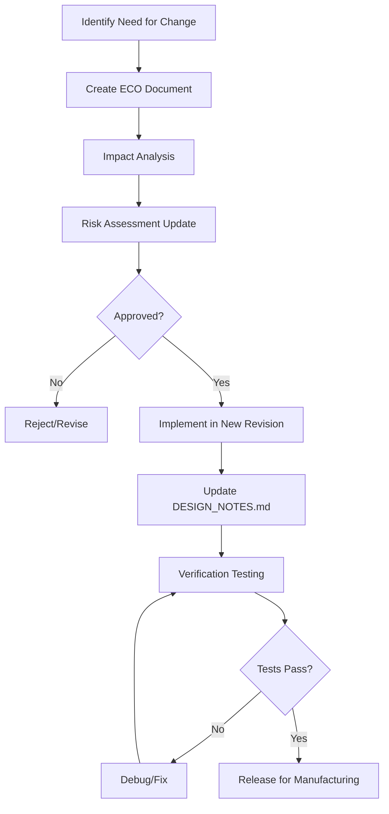
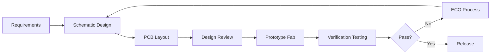

# MobMon12 Hardware Design Repository

**Project:** MobMon12 Medical Monitoring Device - Hardware Design
**Organization:** Kallows Engineering India Pvt Ltd
**KiCAD Version:** 9.0

## Overview

This repository contains the PCB design files, libraries, and hardware-specific documentation for the MobMon12 medical monitoring device. This repository provides **Design Output** documentation that feeds into the larger Design History File (DHF) maintained separately.

### What's In This Repository
- ✅ KiCAD PCB design files (schematics, layouts)
- ✅ Component libraries (symbols, footprints, 3D models)
- ✅ Manufacturing outputs (gerbers, BOMs, assembly files)
- ✅ Hardware design documentation and test reports
- ✅ Mechanical CAD files (enclosures, covers)
- ✅ Design automation tools and scripts

### What's NOT In This Repository
- ❌ Quality management procedures (maintained in QMS)
- ❌ Regulatory submissions (maintained separately)
- ❌ Clinical/validation documentation
- ❌ Software/firmware source code

---

## Repository Structure

```
mobmon12-hardware/
├── hardware/          # PCB design files (KiCAD projects)
├── libraries/         # Shared component libraries
├── mechanical/        # CAD files for enclosures and covers
├── docs/              # Hardware-specific documentation
├── manufacturing/     # Production outputs (gerbers, BOMs, etc.)
├── tools/             # Scripts and utilities
├── config/            # Configuration and templates
└── archive/           # Obsolete files
```

### Quick Navigation

| I want to... | Go to... |
|--------------|----------|
| Open the latest mainboard design | `hardware/mainboard/latest/` |
| Find a component footprint | `libraries/footprints/` |
| Generate manufacturing files | See `tools/fabrication/` |
| View test reports | `docs/verification/test_reports/` |
| Find design calculations | `docs/design/calculations/` |
| Access gerber files | `manufacturing/mainboard/[revision]/gerbers/` |

---

## Hardware Boards

### Mainboard (mobmon12_mainboard)
Main monitoring unit with ECG acquisition, processing, and connectivity.

**Latest Revision:** rev06a → `hardware/mainboard/latest/`

| Revision | Status | Notes |
|----------|--------|-------|
| rev06b | Development | Latest features |
| rev06a | Released | Current production |
| rev05b | Released | Previous generation |
| rev05a | Released | First 05 series |
| rev04 | Archived | Prototype only |

### Yoke Board (mobmon12_yoke)
Connector/interface board for patient connections.

**Latest Revision:** rev02c → `hardware/yoke/latest/`

### Defibrillator Board (mobmon12_defib)
Defibrillator interface module.

**Latest Revision:** rev01a → `hardware/defib/latest/`

---

## Getting Started

### Prerequisites
- KiCAD 9.0 or later
- Python 3.8+ (for tools)
- Git

### Opening a Project
1. Navigate to the desired board and revision:
   ```bash
   cd hardware/mainboard/latest/
   ```

2. Open the project file in KiCAD:
   ```bash
   kicad mobmon12_mainboard.kicad_pro
   ```

3. Libraries are automatically loaded from `libraries/` directory

### Creating a New Revision

1. Copy the template:
   ```bash
   cp -r config/templates/revision_template hardware/mainboard/rev07a
   ```

2. Copy files from previous revision
3. Update `metadata.json` with new revision info
4. Update `DESIGN_NOTES.md` with changes
5. Update symlink when ready for development:
   ```bash
   ln -sf rev07a hardware/mainboard/latest
   ```

---

## Documentation Structure

### Design Documentation (`docs/design/`)
- **architecture/** - System architecture, block diagrams
- **calculations/** - Power budgets, thermal analysis, signal integrity
- **component_selection/** - Component rationale, approved parts list
- **standards_compliance/** - IEC 60601 design compliance

### Verification (`docs/verification/`)
- **test_plans/** - Test planning documents
- **test_reports/** - Verification test results
- **test_procedures/** - Detailed test procedures

### Risk Management (`docs/risk/`)
Hardware-specific hazard analysis and risk controls

### Changes (`docs/changes/`)
Engineering Change Orders (ECOs) tracking all design changes

---

## Manufacturing

### Generating Manufacturing Outputs

Use the automated script:
```bash
cd tools/fabrication
python generate_manufacturing_outputs.py --board mainboard --revision rev06a
```

This generates:
- Gerber files
- Drill files
- BOM (multiple formats)
- Component placement list (CPL)
- Interactive BOM (HTML)
- Assembly drawings (PDF)
- Schematic PDF

### Manufacturing Output Locations

```
manufacturing/[board_type]/[revision]/
├── gerbers/              # Gerber + drill files
├── assembly/             # BOM, CPL, iBOM
├── fabrication/          # Stackup, impedance specs
├── documentation/        # Schematics, assembly drawings
└── RELEASE_MANIFEST.md   # Release documentation
```

---

## Component Libraries

### Library Structure
- **symbols/** - Schematic symbols (`.kicad_sym`)
- **footprints/** - PCB footprints (`.kicad_mod` in `.pretty/` directories)
- **3dmodels/** - 3D models (`.step`, `.wrl` files)

### Using Libraries
Libraries are configured via:
- `config/kicad/sym-lib-table` - Symbol library table
- `config/kicad/fp-lib-table` - Footprint library table

These use relative paths and are automatically loaded by KiCAD projects.

### Adding New Components
1. Add symbol to `libraries/symbols/Kallows_Symbols.kicad_sym`
2. Add footprint to `libraries/footprints/Kallows.pretty/`
3. Add 3D model to `libraries/3dmodels/Kallows.3dshapes/`
4. Document in `libraries/CHANGELOG.md`

---

## Tools and Scripts

| Tool | Purpose | Location |
|------|---------|----------|
| BOM Search | Search Mouser API for parts | `tools/bom/` |
| BOM Validator | Validate against approved parts | `tools/bom/` |
| Panelization | Create manufacturing panels | `tools/panelization/` |
| Output Generator | Generate all manufacturing files | `tools/fabrication/` |
| Design Validator | Run DRC/ERC checks | `tools/fabrication/` |

See `tools/README.md` for detailed documentation.

---

## Compliance and Standards

This hardware is designed to meet:
- **IEC 60601-1**: Medical electrical equipment - General safety
- **IEC 60601-1-2**: EMC requirements
- **IEC 60601-2-27**: ECG monitoring equipment
- **ISO 13485**: Medical device quality management
- **ISO 14971**: Risk management for medical devices

Design compliance is documented in `docs/design/standards_compliance/`.

---

## Workflow Diagrams

### Design Change Process



### Hardware Development Flow



---

## Version Control

### Git Workflow
- **main** branch: Released designs only
- **develop** branch: Active development
- Feature branches: `feature/rev07a-power-redesign`
- Tag releases: `mainboard-rev06a-release-v1.0`

### What's Tracked in Git
- All KiCAD source files
- Library files
- Documentation
- Scripts and tools
- Configuration files

### What's Ignored
- Generated gerbers (except release packages)
- Temporary KiCAD files (`*.kicad_prl`, backups)
- Python virtual environments
- Large binary files (use release packages instead)

---

## Contributing

### Making Changes
1. Create feature branch from `develop`
2. Make changes in appropriate revision directory
3. Update `DESIGN_NOTES.md` with changes
4. Run design validation: `python tools/fabrication/validate_design.py`
5. Create pull request with description

### Design Reviews
All hardware changes require design review before release. See `docs/design/` for review checklists.

---

## Support and Contact

**Project Lead:** [Name]
**Email:** [Email]
**Issue Tracking:** [Link to issue tracker]

---

## License

**Proprietary and Confidential**

Copyright © 2024 Kallows Engineering India Pvt Ltd. All rights reserved.

This repository contains confidential and proprietary information. Unauthorized use, disclosure, or distribution is strictly prohibited.

---

## Document Control

| Version | Date | Author | Changes |
|---------|------|--------|---------|
| 1.0 | 2025-10-20 | Claude Code | Initial repository structure |

**Last Updated:** 2025-10-20
