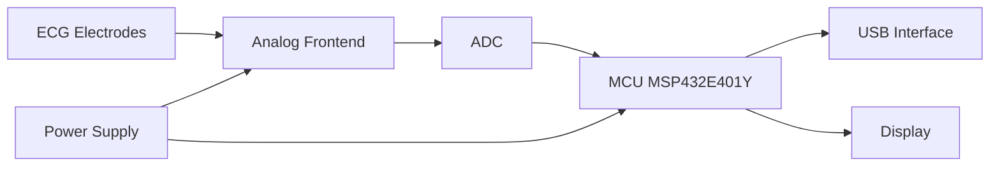
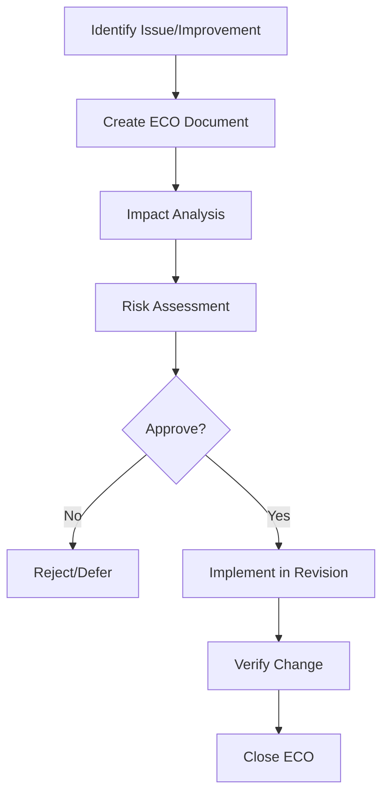
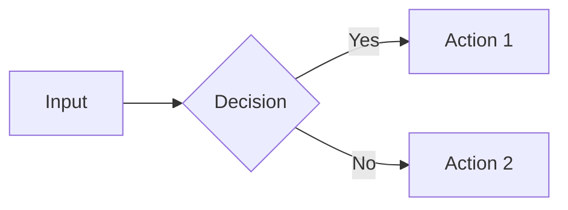

# Hardware Documentation

This directory contains all hardware-specific documentation for the MobMon12 PCB designs. This documentation feeds into the larger Design History File (DHF) maintained separately.

## Directory Structure

```
docs/
├── design/             # Design documentation and rationale
│   ├── architecture/
│   ├── calculations/
│   ├── component_selection/
│   └── standards_compliance/
│
├── verification/       # Hardware verification test documentation
│   ├── test_plans/
│   ├── test_reports/
│   └── test_procedures/
│
├── risk/               # Hardware-specific risk analysis
├── changes/            # Engineering Change Orders (ECOs)
└── datasheets/         # Component datasheets
```

---

## Design Documentation (`design/`)

### Architecture (`design/architecture/`)
High-level system architecture and design approach.

**Contents:**
- `system_block_diagram.md` - Overall system architecture with Mermaid diagrams
- `power_architecture.md` - Power distribution and regulation
- `signal_flow.md` - Signal path from sensors to output

**Example: system_block_diagram.md**
````markdown
# System Block Diagram



## Design Rationale
...
````

### Calculations (`design/calculations/`)
Engineering calculations supporting design decisions.

**Contents:**
- `power_budget.xlsx` - Power consumption analysis
- `thermal_analysis.xlsx` - Thermal calculations and heatsink sizing
- `impedance_calculations.md` - Impedance controlled traces
- `signal_integrity/` - Signal integrity simulations and analysis

**Purpose:** Provides evidence that design meets specifications (DHF requirement).

### Component Selection (`design/component_selection/`)
Rationale for critical component choices.

**Contents:**
- `critical_components_rationale.md` - Justification for key components
- `obsolescence_plan.md` - Component lifecycle monitoring
- `approved_parts_list.xlsx` - List of approved components for medical use

**Example: critical_components_rationale.md**
```markdown
# Critical Component Selection Rationale

## Isolation Amplifier: ISO124

### Requirements
- Medical-grade isolation (IEC 60601-1: 2xMOPP)
- Low noise (<10µVpp)
- High CMRR (>100dB)

### Selection Criteria
| Component | Isolation | Noise | CMRR | Cost | Selected |
|-----------|-----------|-------|------|------|----------|
| ISO124    | 2500Vrms  | 5µVpp | 120dB| $5.20| ✓        |
| AMC1301   | 4250Vrms  | 8µVpp | 100dB| $4.80| -        |

### Justification
ISO124 selected for superior noise performance critical for ECG acquisition...
```

### Standards Compliance (`design/standards_compliance/`)
Documentation of how design meets regulatory standards.

**Contents:**
- `IEC_60601-1_design_checklist.md` - Electrical safety compliance
- `IEC_60601-1-2_emc_design.md` - EMC design measures
- `isolation_design.md` - Isolation barrier design and verification

---

## Verification Documentation (`verification/`)

### Test Plans (`verification/test_plans/`)
High-level test plans describing what will be tested and how.

**Contents:**
- `electrical_safety_test_plan.md`
- `emc_test_plan.md`
- `functional_test_plan.md`

**Template:**
```markdown
# [Test Type] Test Plan

## Objective
Define tests to verify [aspect] meets requirements.

## Scope
- What will be tested
- What will NOT be tested

## Test Items
- Mainboard rev06a
- Yoke board rev02c

## Pass/Fail Criteria
| Test | Requirement | Pass Criteria |
|------|-------------|---------------|
| ... | ... | ... |

## Test Schedule
...
```

### Test Procedures (`verification/test_procedures/`)
Detailed step-by-step test procedures.

**Contents:**
- `power_supply_test.md` - Power supply verification procedure
- `ecg_signal_path_test.md` - ECG signal chain testing
- `isolation_test.md` - Isolation barrier verification

**Template:**
```markdown
# [Test Name] Test Procedure

## Equipment Required
- Oscilloscope: Tektronix MSO5xxx or equivalent
- Function generator: Keysight 33500B
- DMM: Fluke 87V

## Setup
1. Connect device under test (DUT)...
2. Configure test equipment...

## Procedure
### Test 1: [Test Name]
1. Step-by-step instructions...
2. Record measurement: ___________
3. Compare to acceptance criteria

## Acceptance Criteria
- [Parameter] shall be [value] ± [tolerance]

## Results
[To be filled during testing]
```

### Test Reports (`verification/test_reports/`)
Results from verification testing.

**Structure:**
```
test_reports/
├── mainboard_rev06a/
│   ├── electrical_safety_report.md
│   ├── functional_test_report.md
│   ├── emc_pre_test_report.md
│   └── test_data/              # Raw data, screenshots, oscilloscope captures
│       ├── power_supply_ripple.png
│       └── emc_scan_data.xlsx
└── yoke_rev02c/
    └── ...
```

**Template:**
```markdown
# [Board] [Revision] - [Test Type] Test Report

## Test Information
- **Board:** Mainboard
- **Revision:** rev06a
- **Test Date:** 2024-03-15
- **Tested By:** John Doe
- **Test Procedure:** [Link to procedure]

## Test Setup
[Description and photos of test setup]

## Test Results

### Test 1: Power Supply Ripple
- **Requirement:** <50mVpp
- **Result:** 23mVpp
- **Status:** PASS ✓
- **Evidence:** [Link to oscilloscope capture]

### Test 2: ...
...

## Summary
- Total Tests: 25
- Passed: 24
- Failed: 1 (see section 5.3)
- Not Tested: 0

## Failed Tests
### Test 5.3: EMC Radiated Emissions at 145MHz
- **Requirement:** <40dBµV/m
- **Result:** 38dBµV/m (marginal)
- **Issue:** Close to limit, needs investigation
- **Action:** ECO-027 opened to add ferrite bead

## Conclusion
Design meets all electrical safety requirements. One EMC marginal result to be addressed in next revision.

## Approvals
- **Tested By:** ___________ Date: ___________
- **Reviewed By:** ___________ Date: ___________
```

---

## Risk Documentation (`risk/`)

Hardware-specific hazard analysis and risk controls.

**Contents:**
- `hardware_hazard_analysis.xlsx` - Hazards specific to hardware design
- `hardware_fmea.xlsx` - Failure Mode and Effects Analysis for PCB
- `risk_control_implementation.md` - How hardware implements risk controls
- `README.md` - Links to main Risk Management File (RMF)

**Purpose:** Documents hardware design's contribution to risk management. Links to main RMF maintained separately.

**Example Hazard:**
| Hazard ID | Hazard | Cause | Effect | Severity | Probability | Risk | Control Measure | Residual Risk |
|-----------|--------|-------|--------|----------|-------------|------|-----------------|---------------|
| HW-001 | Electric shock | Isolation failure | Patient injury | Catastrophic | Remote | Medium | 2xMOPP isolation, creepage/clearance per IEC 60601-1 | Low |

---

## Change Documentation (`changes/`)

Engineering Change Orders (ECOs) tracking all hardware design changes.

**Contents:**
- `ECO_template.md` - Template for new ECOs
- `ECO_001_description.md` - Individual ECO documents
- `ECO_log.xlsx` - Master ECO tracking spreadsheet

### ECO Numbering
Format: `ECO-NNN`
- Start at ECO-001
- Sequential numbering
- Never reuse numbers

### ECO Process



### ECO Template
```markdown
# ECO-NNN: [Brief Description]

## ECO Information
- **ECO Number:** ECO-NNN
- **Date Created:** YYYY-MM-DD
- **Created By:** [Name]
- **Status:** Open / In Progress / Closed / Rejected

## Problem Description
[What is the issue or improvement opportunity?]

## Root Cause
[Why did this happen? Root cause analysis.]

## Proposed Solution
[What change will be made?]

## Impact Analysis

### Affected Boards
- [ ] Mainboard (all revisions / rev06a only)
- [ ] Yoke board
- [ ] Defib board

### Affected Documents
- [ ] Schematic (sheet: _______)
- [ ] PCB layout
- [ ] BOM
- [ ] Test procedures
- [ ] Risk analysis
- [ ] Other: __________

### Regulatory Impact
- [ ] No regulatory impact
- [ ] Requires DHF update
- [ ] Requires revalidation
- [ ] Requires regulatory submission

## Risk Assessment
**Before Change:**
- Severity: ___
- Probability: ___
- Risk Level: ___

**After Change:**
- Severity: ___
- Probability: ___
- Risk Level: ___

## Implementation
**Implemented In:** Mainboard rev06b
**Implementation Date:** YYYY-MM-DD
**Git Commit:** [commit hash]

## Verification
- [ ] Schematic review completed
- [ ] Layout DRC passed
- [ ] Prototype tested
- [ ] Test report: [link]

## Approvals
- **Engineering:** ___________ Date: ___________
- **Quality:** ___________ Date: ___________

## Closure
**Closed By:** [Name]
**Closure Date:** YYYY-MM-DD
**Verified In:** rev06b verification test report
```

---

## Datasheets (`datasheets/`)

Component datasheets organized by function.

**Structure:**
```
datasheets/
├── microcontroller/
│   └── MSP432E401Y_datasheet.pdf
├── analog_frontend/
│   ├── INA333_instrumentation_amp.pdf
│   └── OPA2277_opamp.pdf
└── power_management/
    ├── LM317_linear_regulator.pdf
    └── TPS54560_buck_converter.pdf
```

**Guidelines:**
- Keep only datasheets for components actually used
- Name files clearly: `[MPN]_[description].pdf`
- Update when component versions change
- Link from schematics where critical

---

## Documentation Standards

### Markdown Format
All documentation uses Markdown with Mermaid diagrams.

**Benefits:**
- Version controlled (Git)
- Easy to review/diff
- Renderable in GitHub/GitLab
- Can be automated/scripted

### Mermaid Diagrams
Use Mermaid for:
- Block diagrams
- Flow charts
- State machines
- Sequence diagrams

**Example:**


### Document Templates
Templates are in `config/templates/document_templates/`:
- `ECO_template.md`
- `test_report_template.md`
- `test_plan_template.md`

### Cross-References
Use relative links between documents:
```markdown
See [Power Budget](calculations/power_budget.xlsx) for detailed analysis.
Addresses hazard [HW-001](../risk/hardware_hazard_analysis.xlsx).
```

---

## Integration with DHF

This hardware documentation feeds into the external DHF:

| This Repository | DHF Section |
|-----------------|-------------|
| `docs/design/` | DHF → Design Outputs → Electrical Design |
| `docs/verification/` | DHF → Verification |
| `docs/risk/` | RMF → Hardware Hazards |
| `docs/changes/` | DHF → Design Changes |

---

## See Also
- [Hardware Design Files](../hardware/README.md)
- [Verification Test Procedures](verification/test_procedures/README.md)
- [Risk Management](risk/README.md)
